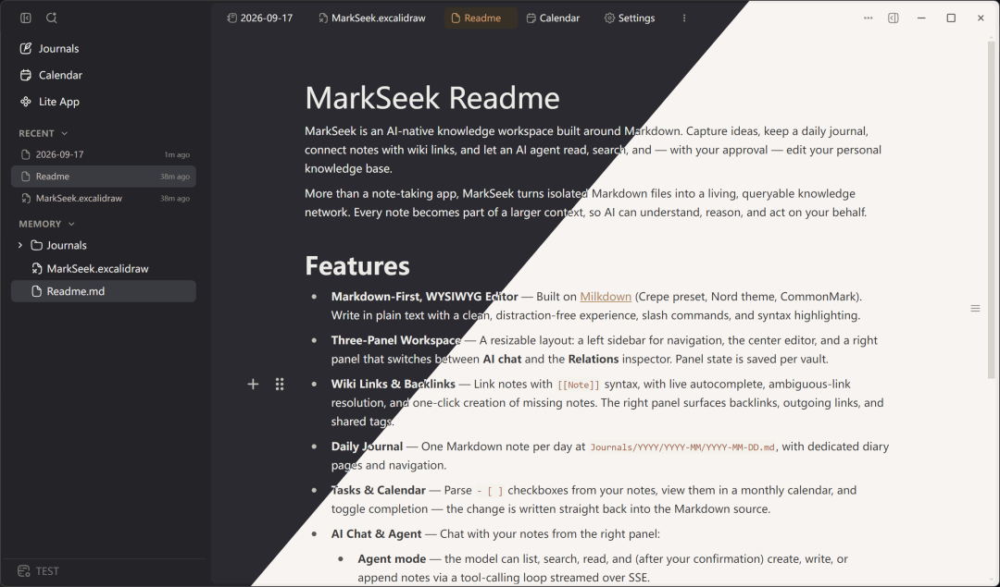

# MarkSeek

**你的知识，彼此相连。你的智能，由此放大。**

> 🌐 其他语言：[English](README.md)

## 序 · 来自作者的一点话

我不是一个前端或后端工程师，没有 HTML、TypeScript、CSS 的任何经验。这个应用，从第一行代码到打包发布，**完全是通过 AI 完成的**。

它现在当然还不完善——还有很多我想做但还没做的功能，也难免有 bug。但对我自己的日常记录、笔记和日记来说，它已经基本够用了。

我想说的是：在 AI 时代，我觉得**每个人都可以做出属于自己的 AI 笔记**。不会有一个笔记应用能真正满足你，因为你的思考方式、你记东西的习惯，是独一无二的。与其等别人做一个「完美」的产品，不如自己给自己靠一个——而这个 MarkSeek，就是一个样例。

如果你也想要一个懂你、属于你的知识空间，希望它能给你一点勇气和参考：动手试试，让 AI 帮你把想法落地。

---

[](LICENSE)
[](https://github.com/MarkSeek/MarkSeek/actions/workflows/ci.yml)

MarkSeek 是一个以 Markdown 为核心的、原生 AI 知识工作台。在这里你可以记录灵感、写每日日记、用 Wiki 链接串联笔记，并让 AI 智能体去阅读、检索你的知识，在获得你许可后还能帮你编辑。

它不只是一个笔记软件，而是把零散的 Markdown 文件变成一张鲜活的、可检索的知识网络。每一条笔记都成为更大语境的一部分，AI 因此能理解、推理，并替你行动。

<p align="center">
  
</p>

## 功能特性

- **Markdown 优先的所见即所得编辑器** — 基于 [Milkdown](https://milkdown.dev)（Crepe 预设、Nord 主题、CommonMark）。纯净、无干扰的写作体验，支持斜杠命令与语法高亮。
- **三栏式工作区** — 可拖拽调节的布局：左侧边栏用于导航，中间是编辑器，右侧面板可在 **AI 对话** 与 **关系（Relations）** 检视器之间切换。面板状态按知识库（vault）分别保存。
- **Wiki 链接与反向链接** — 用 `[[笔记]]` 语法互链，支持实时自动补全、歧义链接解析，以及一键创建缺失的笔记。右侧面板会展示反向链接、出站链接与共享标签。
- **每日日记** — 每天一篇 Markdown 笔记，路径为 `Journals/YYYY/YYYY-MM/YYYY-MM-DD.md`，并配有专门的日记页面与导航。
- **任务与日历** — 从笔记中解析 `- [ ]` 勾选清单，在月历中查看，并可直接切换完成状态——改动会写回 Markdown 源文件。
- **AI 对话与智能体** — 在右侧面板中与你的笔记对话：
  - **智能体模式（Agent）** — 模型可列出、检索、阅读笔记，并在你的确认后通过 SSE 流式工具调用循环来创建、写入或追加笔记。
  - **问答模式（Ask）** — 只读助手，仅基于你的笔记进行推理，绝不修改任何内容。
  - **编辑器内联 AI** — 在编辑器内直接续写 / 改写 / 总结，由服务端代理转发到你的模型。
- **本地优先的知识库** — 你的笔记就是你选定的文件夹里的纯 `.md` 文件。支持在多个知识库间切换；设置按知识库存于应用数据目录，绝不会写进笔记里。
- **可插件扩展** — 一套扩展系统（`window.markseek` SDK），支持自定义编辑器节点、主题、侧边栏面板与整页渲染器（内置 Excalidraw 画布、Mermaid 图表、自定义块与示例主题）。
- **多模型供应商** — 可指向任意 OpenAI 兼容的接口，管理多个供应商 / 模型，并通过 直连 / 系统代理 / 自定义代理 路由出网请求。API Key 只保存在服务端，绝不会发给浏览器。
- **跨平台** — 既可打包为 Electron 桌面应用，也可作为自托管的 Web 版本运行。

## 架构

MarkSeek 是一个带 Web 构建版本的 Electron 桌面应用：

- **前端** — React 18 + TypeScript、Vite 6、Milkdown 7（所见即所得 Markdown 编辑器）。渲染层是单页应用，通过同源的 `/api/*` 接口与后端通信。
- **后端** — `server/` 下一个轻量的 Node.js 服务，负责托管应用并暴露 `/api/*` 接口（文件、设置、AI、智能体、关系、任务、插件）。在 Electron 中由主进程内嵌该服务；在 Web 构建中由 `app/app.js`（Node）托管同一份代码，开发与生产环境保持一致。
- **共享内核** — `shared/` 中的纯函数助手（`relations`、`wiki-link`、`journal-layout`）以纯 ESM 形式同时被浏览器与 Node 后端引用，确保链接、反链、日记路径在两端表现完全一致。
- **布局** — 左侧边栏（文件树、知识库切换）· 中间编辑器（Milkdown + 日记/日历/轻应用页面）· 右侧面板（AI 对话 / 关系）。

```
src/        React UI：各面板、编辑器、智能体对话、国际化、上下文、API 客户端
server/     Node 后端：/api 路由、文件系统、AI 供应商、智能体循环、设置
shared/     浏览器与 Node 共用的纯 ESM 助手（关系、维基链接、日记布局）
electron/   Electron 主进程 + 预加载脚本（内嵌服务端）
app/        Web / Node 生产构建使用的静态托管（app/app.js）
public/     静态资源（图标、svg）
plugins/    内置插件的源码（excalidraw、mermaid、custom-block、theme-sample）
```

## 快速开始

### 环境要求

- Node.js >= 20
- npm（随 Node 一并安装）

### 安装

```bash
npm install
```

### 开发

```bash
npm run dev            # Vite 开发服务器，地址 http://localhost:9000（API 在进程内处理）
npm run start:electron # 以调试模式启动 Electron 应用
```

### 构建与运行

```bash
npm run build          # 类型检查 + 构建到 dist/（并打包插件）
npm run start          # 通过 Node 托管生产构建（app/app.js）
npm run preview        # 本地预览生产构建（Vite）
```

### 打包分发（Electron）

```bash
npm run package        # 仅打包（out/ 下的未压缩应用目录）
npm run make           # 打包 + 构建安装包（zip / deb / rpm / dmg / AppImage）
```

Windows 下会生成 Squirrel 安装包；Linux 下生成 `deb`/`rpm`（当缺少 Squirrel 的 Mono/Wine 工具链时回退为 ZIP/AppImage）；macOS 下生成 `dmg`/`zip`。代码签名通过环境变量按需开启。

### 配置 AI

AI 供应商与 API Key 在应用内的 **设置** 面板中配置（支持多供应商、任意 OpenAI 兼容接口）。Key 会**本地**保存在你对应知识库的应用数据中，**绝不会**提交到仓库，也不会暴露给浏览器。详见 [SECURITY.md](SECURITY.md)。

## 测试与质量

```bash
npm run check          # 类型检查 + 运行测试套件（vitest）
npm run test           # 运行一次测试
npm run test:watch     # 监听模式
npm run test:coverage  # 覆盖率报告
```

提交与 Pull Request 时，CI 会自动运行上述检查。

## 贡献

欢迎参与贡献！提交 PR 前请先阅读 [CONTRIBUTING.md](CONTRIBUTING.md)，了解开发环境搭建、代码规范与提交流程。

## 安全

发现了安全漏洞？请查阅 [SECURITY.md](SECURITY.md) 了解如何负责任地反馈。

## 许可证

MarkSeek 基于 [MIT 许可证](LICENSE) 发布。
